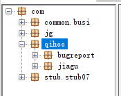
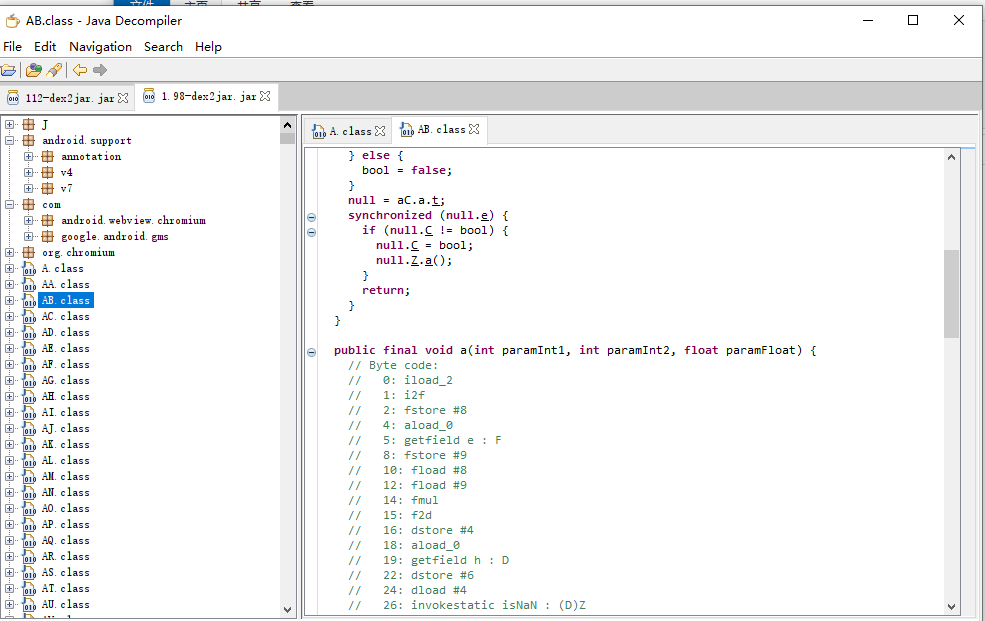
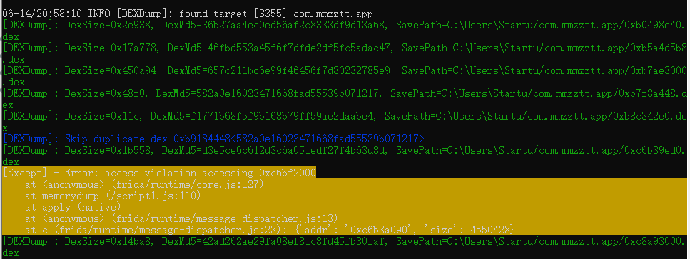
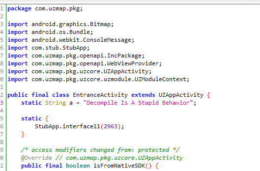
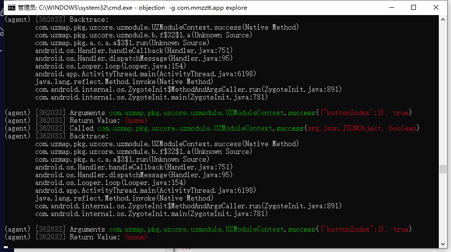
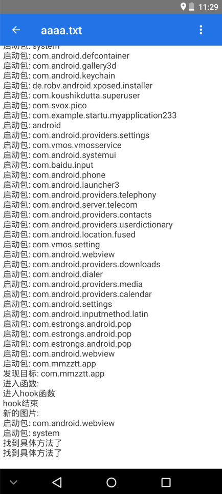
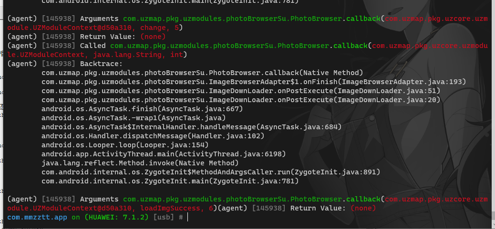
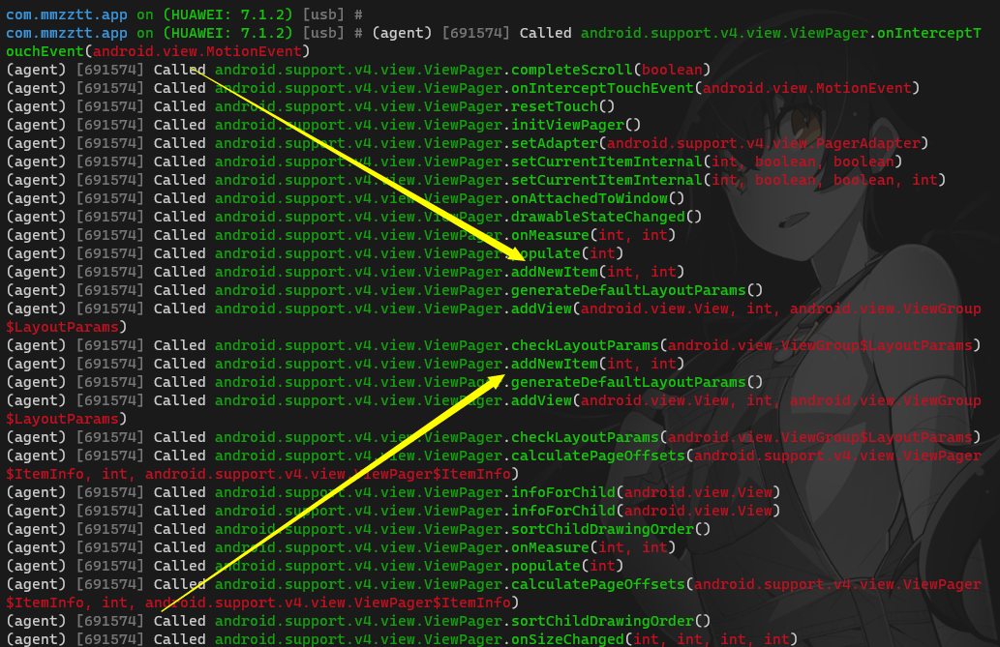
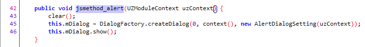

dwda


# 哭了

目前的进度是

+ 通过内存dump的方式，破壳了。
+ 但是代码混淆严重
+ 通过jd-gui得到的类名似乎并不准确，以至于通过`frida`下hook会找不到类
+ 网络上找到的穿透加固的下hook方法并不好用
+ 通过别的逆向工具得到的类名和jd-gui的类名并不相同
+ 接下来准备尝试通过别的方法dump内存，然后看看能否得到准确的类名
+ 通过`frida`枚举的类名并不完整


未来想要尝试的

+ 尝试通过别的dump方式得到dex，因为通过目前的方式拿到dex的过程看起来并不正常
+ 使用 脱壳工具FRIDA-DEXDump
  + [脱壳工具FRIDA-DEXDump - 吴先雨 - 博客园 (cnblogs.com)](https://www.cnblogs.com/wuxianyu/p/14787071.html)
+ objection使用
  + [objection使用 - 走看看 (zoukankan.com)](http://t.zoukankan.com/c-x-a-p-13493629.html)
  + 实际上前者是其插件
+ 一篇看起来大杂烩的文章
  + [转载：实用 FRIDA 进阶 --- objection ：内存漫游、hook anywhere、抓包_freeking101的博客-CSDN博客](https://blog.csdn.net/freeking101/article/details/107749541)


喜大普奔，终于是成功破解这个软件。说是破解但是实际上这是个免费软件，但是软件不提供下载功能。以前的老版本软件是有下载功能的，但是没有收藏功能，很不好用，但是现在新版本有了收藏功能，但是没有了下载功能。。。并不知道是怎么想的，而且很多图片都没有了，好在我都给爬下来了~~

这次逆向过程非常不顺利，不过好在经过两个星期的空余时间，总算是解决掉了。现在记录一下整个过程。


## 初次尝试

最开始的时候大概流程是先改安装包的后缀名，改成`.zip`然后解压出来，得到`.dex`文件，然后通过`dex2jar`工具转换成为`jar`包，接着通过`jd-gui`工具看到代码。

不过此时发现软件是加固的，想来也是，现在很多软件都会加固，所以我也了解一下常见的去壳方式。对于安卓来说，最稳妥的办法就是`dump`内存。以前脱壳的时候使用的是一个`xposed`模块，在虚拟机上面脱壳，我记得好像过程很顺利，但是最后得到的代码并不是很好看。看上去像是被混淆了一样。

考虑到加固技术发展的很快，我没有使用过去的老工具，直接去找了新的`dump`工具，`drizzleDumper`。通过`adb`传输到模拟器上面，运行软件，开启`drizzleDumper`，结果它突然发疯了，一直输出信息。首次使用这个工具，我也不知道是不是正常情况，所以我等了一会儿。觉得差不多了，就通过`Ctrl+C`终止了程序运行。此时`dump`了很多`.dex`文件，但是似乎只有两个大小。一个是`198kb`另一个是`2028kb`。

看上去可能是遇到反`dump`技术。但是不重要，既然已经得到了`dex`文件，就来看看里面都是什么吧。



小的`dex`里面是这个，明显是`360`的加固，老朋友了，第一次破的壳就是`360`的，但是失败了。那是在两年前。现在就再次挑战它。

重要的代码显然不在这里，所以看另一个`dex`



好家伙，看上去好像不太对。首先，并没有看到类似`入口`的代码，其次代码文件的命名全都变成`字母`了。另外有些代码并没有反编译出来。这个看上去就很棘手了。对于命名全都变成字母的问题，我一开始认为这个应该是代码经过了`混淆`。所以，也就继续去分析它的代码。

通过分析，发现软件用了`chromium`，可能是一个内建的浏览器？但是说实话，使用软件的过程并没有觉得它像是一个浏览器外壳。所以并不知道这个项目在这里的用处是什么。然后就是`android.support`这个包。此时看到这个包，我以为是安卓开发的公共代码。因为我在别的`apk`中也见过它，所以直接忽略了它。接下来，就是下面经过"混淆"的代码了。

好在虽然符号名被混淆了，但是内容基本上都反编译出来了。首先进行第一轮筛查，找出了代码文件比较大的。其次通过代码文件`import`的包，推测他是做什么的。


这一套流程之前屡试不爽，但是这次得到的结果确实不尽人意。


## 操作记录

+ 连接虚拟机

  ```Shell
  adb connect 127.0.0.1:62001
  adb forward tcp:27042 tcp:27042
  adb forward tcp:27043 tcp:27043
  ```

+ 指定被操作的进程

  `objection -g com.mmzztt.app explore`

  `frida-ps -U`

+ 列出所有activity

  `android hooking list activities`

  ```java
  com.apicloud.tencentads.SplashActivity
  com.qq.e.ads.ADActivity
  com.qq.e.ads.LandscapeADActivity
  com.qq.e.ads.PortraitADActivity
  com.qq.e.ads.RewardvideoLandscapeADActivity
  com.qq.e.ads.RewardvideoPortraitADActivity
  // 上面的似乎都是和广告相关的东西
  com.uzmap.pkg.EntranceActivity	// 看起来是什么入口？
  com.uzmap.pkg.LauncherUI	// 似乎是入口相关的
  ```

  这里看`com.uzmap`前缀可能有什么戏

+ 列出和`com.uzmap`相关的类

  `android hooking search classes com.uzmap`


## dump dex

+ 安装

  `pip install frida-dexdump`

+ dump dex

  `frida-dexdump`

  

  好像不是很成功的样子

+ 通过`jafx-gui`打开dex

  

  绝了，这个软件的反反编译能力我觉得是真强

+ 终于找到了关键方法

  `com.uzmap.pkg.uzmodules.photoBrowserSu.ImageDownLoader.saveFile(java.io.InputStream, java.lang.String)`

+ 通过分析xml，找到了菜单

+ 找到了取消按钮的点击事件

  

  但是通过这个方法并不能得到什么有用的信息，好像拿不到需要的图片。所以考虑别的方法。

  我有注意到似乎有双击操作。。。
  
+ 使用前面的xposed模板，写入类名和方法，一次成功

+ [Xposed第一课(微信篇) hook含有多个参数的方法 - 简书 (jianshu.com)](https://www.jianshu.com/p/c730b5e0c150)

+ 通过xposed成功拿到双击会触发的方法，感觉快看到胜利的曙光了

+ 

+ 上一步找到了双击，接下来就要获取到当前正在看的图片了

  

  此处找到了在载入图片完成之后会调用的方法了，但是这个方法并不好用

  于是找到了更好用的办法

  android.support.v4.view.ViewPager;

  

  这两个是加载和预加载，通过这两个可以得到加载的具体的具体图片


+ ImageBrowserAdapter 构造函数可以获得列表，但是其中都是url需要取md5

+ `uiautomator dump /sdcard/ui.xml` 命令可以得到当前最顶层的布局

+ `dumpsys window | grep  mCurrentFocus` 命令可以得到最顶层的`Activity`

+ 禁止弹窗

  

